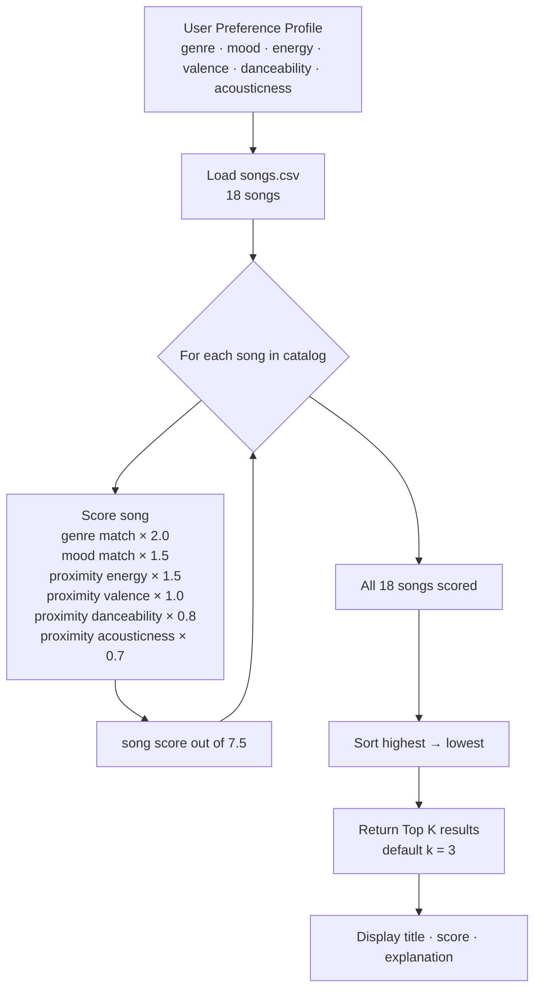
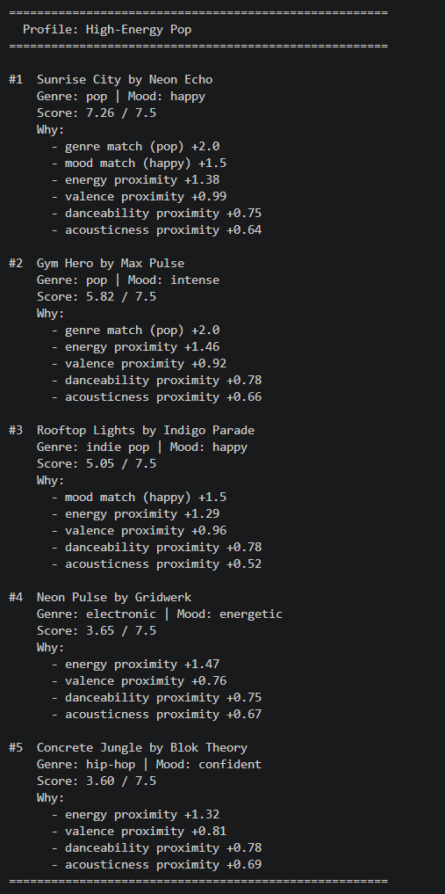
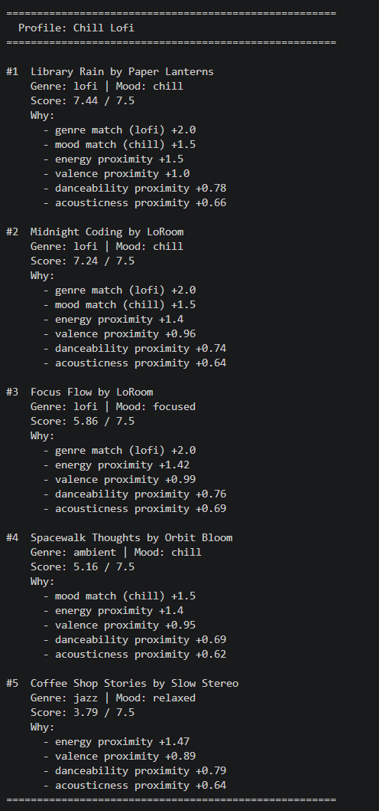
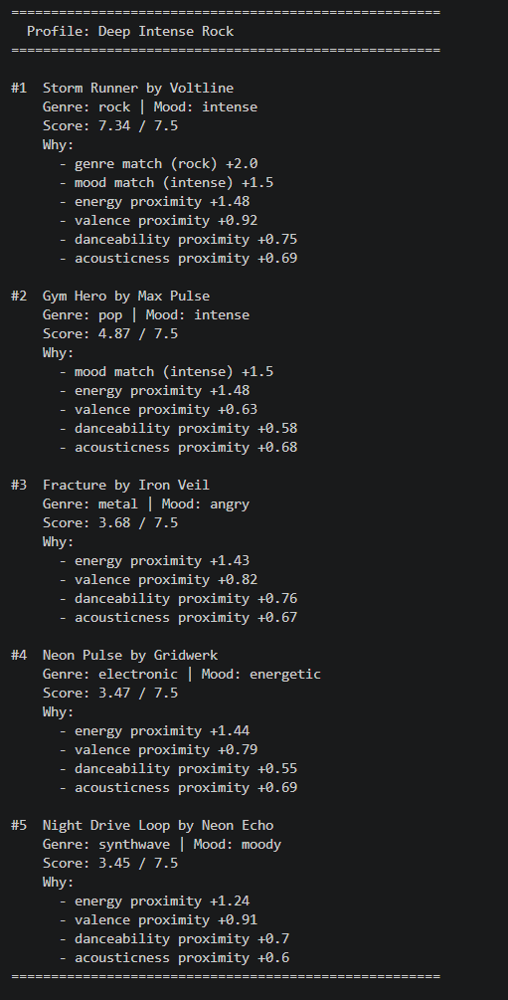
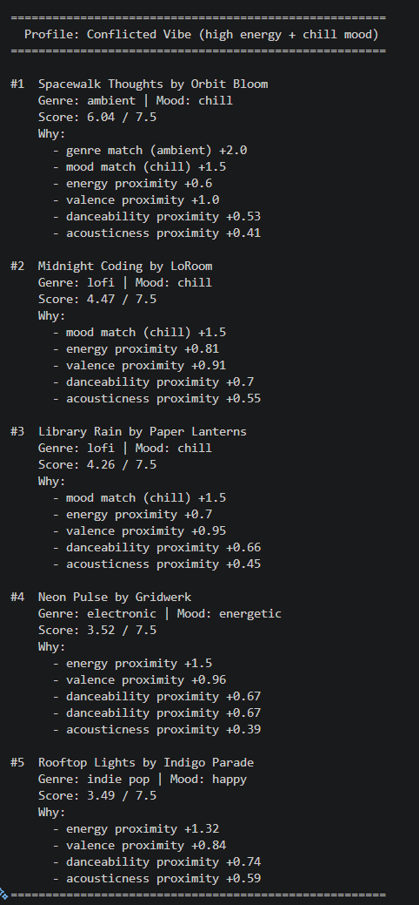
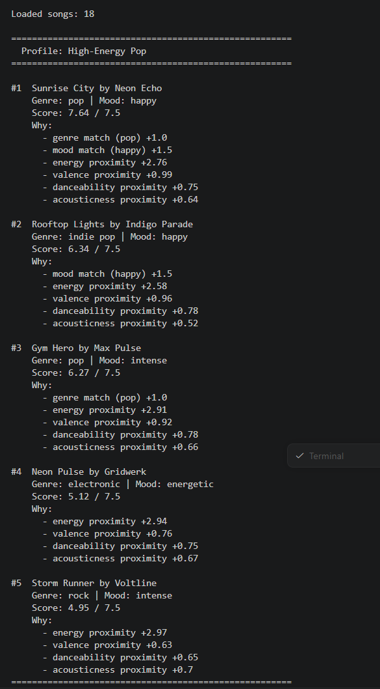
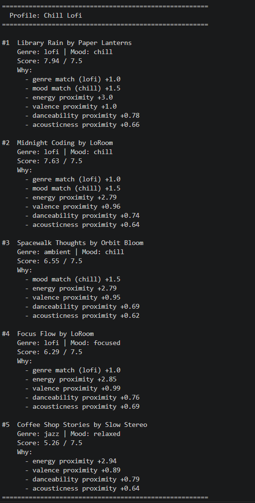
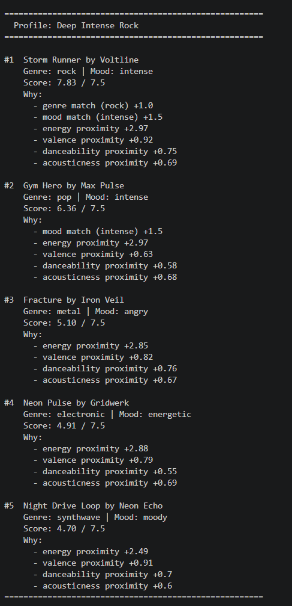
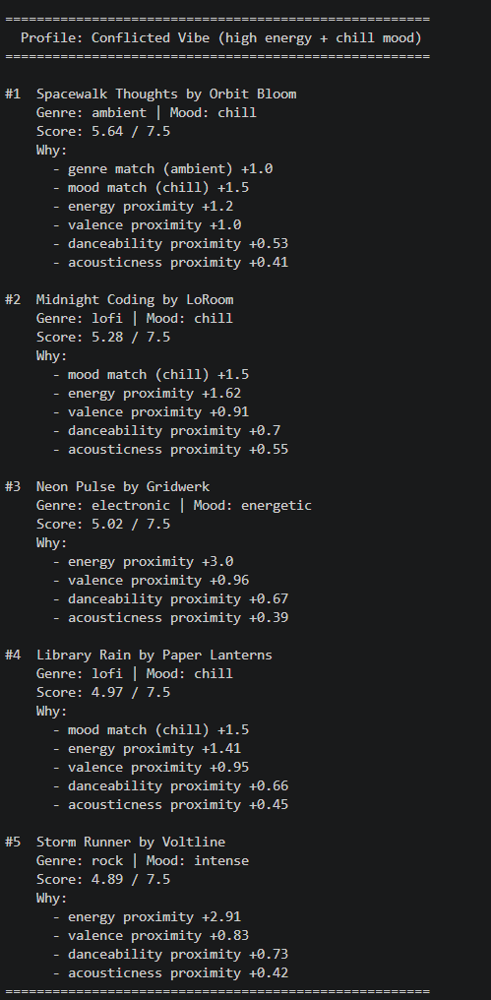

# 🎵 Music Recommender Simulation

## Project Summary

In this project you will build and explain a small music recommender system.

Your goal is to:

- Represent songs and a user "taste profile" as data
- Design a scoring rule that turns that data into recommendations
- Evaluate what your system gets right and wrong
- Reflect on how this mirrors real world AI recommenders

This version builds a content-based music recommender that scores songs by how closely their attributes match a user's taste profile. Energy and valence carry heavy weight so the system can find a lofi jazz track and a soft indie pop song as equally "chill" even though they're different genres.

---

## How The System Works

Real-world recommenders like Spotify's Discover Weekly build a model of your taste. Not just what genres you click, but the underlying audio shape of what you enjoy, and then find songs whose shape is closest to yours. They combine signals from other users (collaborative filtering) and the song's own attributes (content-based filtering) inside massive neural networks. My version strips that down to one idea: represent both a song and a user as a set of numbers, then measure how close those numbers are.

My recommender is purely content-based. It computes a weighted proximity score for each song against the user's taste profile, then ranks all songs and returns the top matches. Genre and mood are treated as categorical matches (full points or zero). Numeric features such as energy, valence, danceability, acousticness are scored by proximity: `1 - |song_value - user_preference|`, so a song that's close to your preference scores near 1.0 and a song that's far away scores near 0.0. The system prioritizes energy and genre as the strongest signals because those are the features that most immediately define a musical "vibe."

### Features each `Song` uses

| Feature        | Type        | Role in scoring              |
| -------------- | ----------- | ---------------------------- |
| `genre`        | categorical | Hard match — weight 2.0      |
| `mood`         | categorical | Soft match — weight 1.5      |
| `energy`       | float 0–1   | Proximity score — weight 1.5 |
| `valence`      | float 0–1   | Proximity score — weight 1.0 |
| `danceability` | float 0–1   | Proximity score — weight 0.8 |
| `acousticness` | float 0–1   | Proximity score — weight 0.7 |

### What `UserProfile` stores

- Preferred `genre` (string)
- Preferred `mood` (string)
- Target `energy` level (float 0–1)
- Target `valence` (float 0–1)
- Target `danceability` (float 0–1)
- Target `acousticness` (float 0–1)

### How scoring works

```
score = (genre_match × 2.0)
      + (mood_match × 1.5)
      + ((1 - |song.energy - user.energy|) × 1.5)
      + ((1 - |song.valence - user.valence|) × 1.0)
      + ((1 - |song.danceability - user.danceability|) × 0.8)
      + ((1 - |song.acousticness - user.acousticness|) × 0.7)
```

Max possible score: **7.5** (perfect match on all features)

### How recommendations are chosen

All songs in the catalog are scored using the rule above. The **Ranking Rule** then sorts them highest-to-lowest and returns the top N results (default: 3). The scoring rule answers "how good is this one song?" and the ranking rule answers "which songs do I actually show the user?"

### Data Flow



### Algorithm Recipe

| Feature | Points | Method |
|---|---|---|
| Genre match | up to 2.0 | Full points if genre equals user preference, zero otherwise |
| Mood match | up to 1.5 | Full points if mood equals user preference, zero otherwise |
| Energy proximity | up to 1.5 | `(1 - \|song.energy - user.energy\|) × 1.5` |
| Valence proximity | up to 1.0 | `(1 - \|song.valence - user.valence\|) × 1.0` |
| Danceability proximity | up to 0.8 | `(1 - \|song.danceability - user.danceability\|) × 0.8` |
| Acousticness proximity | up to 0.7 | `(1 - \|song.acousticness - user.acousticness\|) × 0.7` |

**Max possible score: 7.5**

### Expected Biases

- **Genre lock-in:** Genre carries the most weight (2.0), so a perfectly-matched chill jazz track will still lose to a mediocre lofi track if the user's favorite genre is lofi. Great cross-genre discoveries get buried.
- **Cold start:** The system knows nothing about the user beyond what they explicitly enter. A new user who doesn't know their "target valence" will get a worse result than one who does.
- **Small catalog bias:** With only 18 songs, some genres and moods have only one representative. If the user wants "metal" or "classical," they'll always get the same song at the top regardless of their numeric preferences.
- **No history or feedback:** The system can't learn from what the user skips or replays, so it can't correct itself over time.

---

## Getting Started

### Setup

1. Create a virtual environment (optional but recommended):

   ```bash
   python -m venv .venv
   source .venv/bin/activate      # Mac or Linux
   .venv\Scripts\activate         # Windows

   ```

2. Install dependencies

```bash
pip install -r requirements.txt
```

3. Run the app:

```bash
python -m src.main
```

### Sample Output


### Running Tests

Run the starter tests with:

```bash
pytest
```

You can add more tests in `tests/test_recommender.py`.

---

## Phase 4: Stress Test with Diverse Profiles

### Profile 1: High-Energy Pop

User wants: `genre=pop, mood=happy, energy=0.90, valence=0.85, danceability=0.85, acousticness=0.10`



**Observation:** Sunrise City takes #1 (7.26/7.5) with a perfect genre and mood match and close energy. Gym Hero lands #2 (5.82) with the same genre but the mood doesn't match (intense vs happy), costing it 1.5 points. Rooftop Lights sneaks into #3 through a mood match even with a different genre (indie pop), showing that mood weight (1.5) can make up for a genre miss.

---

### Profile 2: Chill Lofi

User wants: `genre=lofi, mood=chill, energy=0.35, valence=0.60, danceability=0.55, acousticness=0.80`



**Observation:** Library Rain scores a near-perfect 7.44/7.5 because it almost exactly matches every numeric preference. Consistent with Phase 3. Focus Flow (#3, 5.86) gets genre points but misses the mood match (focused vs chill), which drops it well below the top two. Spacewalk Thoughts (#4) gets the mood match without a genre match and still makes top 5, showing the system can find cross-genre picks when the audio numbers are close enough.

---

### Profile 3: Deep Intense Rock

User wants: `genre=rock, mood=intense, energy=0.92, valence=0.40, danceability=0.60, acousticness=0.08`



**Observation:** Storm Runner is the only rock song in the catalog so it locks #1 (7.34/7.5) regardless of numeric fit. The user has no alternative rock option. Gym Hero (#2, 4.87) gets the mood match (intense) and similar energy without the genre bonus, which shows mood weight alone can push a song into the top results.

---

### Profile 4: Conflicted Vibe (edge case: high energy + chill mood)

User wants: `genre=ambient, mood=chill, energy=0.88, valence=0.65, danceability=0.75, acousticness=0.50`



**Observation:** Spacewalk Thoughts wins at 6.04/7.5 even though its energy (0.28) is way off from the user's target (0.88). The genre and mood labels gave it 3.5 points upfront and the energy gap could not overcome that. This is the **categorical weight trap**: the system recommends a soft ambient track to someone who asked for high energy because the labels outweigh the actual sound numbers.

---

## Experiments You Tried

### Does the output feel right? (Accuracy vs. Intuition)

**Chill Lofi profile: felt right.**
Library Rain scoring 7.44/7.5 makes sense. It's literally a lofi track, the mood is chill, and the numbers (energy 0.35, acousticness 0.86, valence 0.60) are almost identical to what I set as my preferences. Midnight Coding at #2 also feels right, same genre and mood, just slightly less close on energy. The only mild surprise was Focus Flow at #3 despite its mood being "focused" not "chill." It got there on genre plus numeric proximity, which feels off. A focused track and a chill track don't feel interchangeable to me even if the energy numbers are similar.

**High-Energy Pop profile: mostly right, one surprise.**
Sunrise City at #1 felt correct. The surprise was Rooftop Lights sneaking into #3 with genre "indie pop" instead of "pop." The system counted that as a genre miss (no +2.0) but gave it +1.5 for the happy mood match, letting it outscore songs that matched energy better. Whether that's right depends on taste. Indie pop and pop really are similar vibes but the system can't see that. It just checks if the strings are equal.

---

### Why did Library Rain rank #1 for the Chill Lofi profile?

```
Score breakdown for Library Rain (energy=0.35, valence=0.60, dance=0.58, acoustic=0.86):

  genre match (lofi)     → +2.00   [hard match, weight 2.0]
  mood match (chill)     → +1.50   [hard match, weight 1.5]
  energy proximity       → +1.50   [(1 - |0.35 - 0.35|) × 1.5 = 1.0 × 1.5]
  valence proximity      → +1.00   [(1 - |0.60 - 0.60|) × 1.0 = exact match]
  danceability proximity → +0.78   [(1 - |0.58 - 0.55|) × 0.8]
  acousticness proximity → +0.66   [(1 - |0.86 - 0.80|) × 0.7]
  ─────────────────────────────────
  Total: 7.44 / 7.5
```

The reason it ranked first is that it hit the two highest-weighted features perfectly (genre +2.0 and mood +1.5), *and* matched energy almost exactly (+1.50 out of a possible 1.50). No other song in the catalog achieves all three simultaneously for this profile. The small deductions came only from danceability and acousticness, where Library Rain was close but not exact.

---

### Is the genre weight too strong?

No single song dominated every list and each profile had a different #1, so the system is not completely broken. But genre weight (2.0) is clearly the deciding factor in close races. The **Conflicted Vibe** result is the clearest evidence. Spacewalk Thoughts won despite having the worst energy match in the top 5 because its genre and mood match returned 3.5 points while the energy penalty only cost around 1.35. A user who wanted high-energy ambient would get a mellow ambient track.

Reducing genre from 2.0 to 0.5 would make energy and valence drive results, which would help with cross-genre cases. But it would also mean a rock user might get pop recommendations if the energy lines up. The right weight depends on whether you trust genre labels or audio attributes more.

---

### Experiment: Weight Shift (genre 2.0→1.0, energy 1.5→3.0)

**New max score: 8.0** (genre 1.0 + mood 1.5 + energy 3.0 + valence 1.0 + dance 0.8 + acoustic 0.7). Note: the display still shows `/ 7.5` since the denominator was not updated for this experiment. Scores above 7.5 are not bugs. They just reflect the higher ceiling.

#### High-Energy Pop (experiment)


**What changed:** Sunrise City holds #1 but Rooftop Lights jumped to #2 (6.34), leapfrogging Gym Hero (6.27). Rooftop Lights has no genre match but its happy mood + close energy now earns more than Gym Hero's genre match + slightly closer energy. Energy weight doing exactly what we expected.

#### Chill Lofi (experiment)


**What changed:** Library Rain still #1 but now scores 7.94 (near-perfect under the new 8.0 ceiling) thanks to a perfect +3.0 energy score. Rankings 2–5 stayed the same. Chill Lofi is stable under this change because the top songs already matched energy well.

#### Deep Intense Rock (experiment)


**What changed:** Storm Runner still dominates at 7.83. No ranking changes at the top. Rock is an easy case because only one rock song exists. Genre, mood, and energy all align so there is nothing to reorder.

#### Conflicted Vibe (experiment)


**Most interesting result.** Spacewalk Thoughts still wins (#1, 5.64) despite its energy (0.28) being far from the target (0.88). The genre and mood match (2.5 pts) still outweighs the energy penalty. But **Neon Pulse jumped to #3** with a perfect energy score of +3.0. Under the original weights it was not even top 5. Now it almost breaks through. The weight shift reduced how much labels dominate but it was not enough to fully fix the edge case. Genre and mood combined still beat a maxed-out energy score.

**Conclusion:** Doubling energy and halving genre made the system more responsive to audio attributes. But genre and mood together (2.5 pts) can still override numeric signals. A real fix would need a minimum energy threshold or genre treated as a soft boost rather than an all-or-nothing match.

> Weights were reverted to the original values (genre=2.0, energy=1.5) after this experiment.

---

## Limitations and Risks

- **Categorical weight trap:** Genre (2.0) and mood (1.5) together are 3.5 out of 7.5 possible points. A song can win despite badly mismatched audio numbers if its labels match.
- **Small catalog:** 18 songs across 14 genres means several genres have only one representative. The rock user always gets Storm Runner first, not because it's the best fit, but because it's the only option.
- **No conflict resolution:** When the user sets contradictory preferences (high energy + chill mood), the system doesn't flag it. It just follows the weights and returns confusing results.
- **Hand-coded attributes:** All numeric values were assigned by one person based on perceived genre norms, not measured audio data. Users with different cultural backgrounds may disagree strongly with the numbers.
- **No feedback loop:** The system can't learn from skips or replays. It gives the same answer every time for the same input regardless of whether the user liked the results.

See [model_card.md](model_card.md) for a deeper analysis.

---

## Reflection

Read and complete `model_card.md`:

[**Model Card**](model_card.md)

Building this recommender taught me that a system's behavior is mostly decided before any user ever touches it. The weights you assign, the features you include, and the data you collect all shape the output before a single recommendation is made. I assumed genre would be a reasonable anchor but the Conflicted Vibe experiment showed that leaning too hard on a label can completely override what the user described in numbers. The system was doing exactly what I told it to do. The problem was I told it the wrong thing. Real-world recommenders face the same tension at massive scale, which is why Spotify combines what similar users played with audio signals. Neither alone is reliable enough.

Bias in a system like this is quieter than I expected. It doesn't look like an obvious mistake. It looks like a reasonable result. Spacewalk Thoughts showing up for a high-energy user makes perfect sense on paper because the genre and mood match. You would only notice something was wrong if you actually listened and thought "wait, this is way too soft." That gap between what the math says and what a human hears is exactly where problems hide in real AI products. A music app that keeps recommending the same genre because the weights favor it, or that never recommends music from underrepresented cultures because they're not in the training data, will feel completely normal to most users. But it's leaving some people out every time.

---

